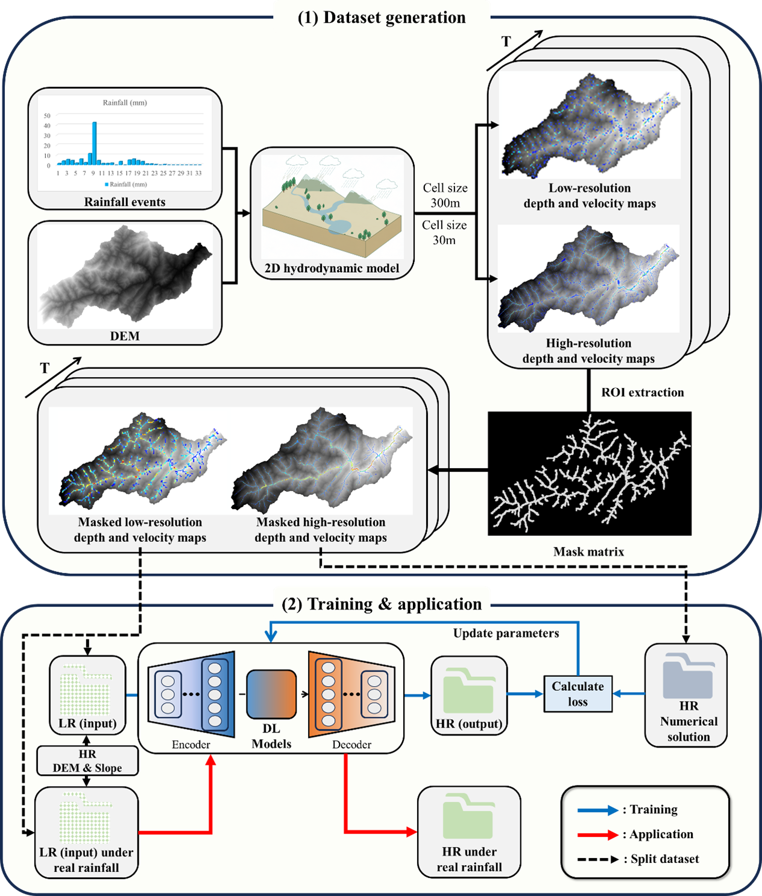

# FFSR-PointNet 
[](...)

## Paper Information
**Title**: Intelligent flow field simulation for real time flash flood dynamics in mountainous catchments</p>
**DOI**: ...</p>
**Abstract**: Flash floods in mountainous regions pose severe threats to life and infrastructure, making high-resolution simulation of flow dynamics critical for precise early warning. However, real-time, high-resolution forecasting in ungauged, topographically complex basins remains a major challenge due to prohibitive computational costs of hydrodynamic models and the scarcity of calibration data. To address this challenge, we propose a downscaling framework built upon our PointNet-based flash flood flow field super-resolution model (FFSR-PointNet) to reconstruct high-resolution flood water-depth and velocity fields from coarse-grid hydrodynamic simulations. To mitigate the severe zero-inflation problem commonly encountered by CNN-based methods in mountainous basins, FFSR-PointNet is trained only on grid cells within the dilated river network region of interest (ROI), reducing each sample to 6.61% of the full watershed grid cells and substantially improving training efficiency. The proposed framework is demonstrated at two spatial scales: the Shouxi River watershed (30 m grid) and Sanjiang Town (1.5 m grid). FFSR-PointNet achieves excellent reconstruction accuracy at both scales, with correlation coefficients reaching 0.99 and very low RMSE at the village scale. To improve cross-region transferability, an adaptive transfer learning strategy is introduced. By fine-tuning the model with only 36 target domain samples (13.3% of the source domain data), the transferred model from Sanjiang Town to Yuhuo Town maintains correlation coefficients above 0.97 for both water depth and velocity, while requiring only 364 s of training. These results demonstrate that the proposed framework can efficiently generate accurate HR flood fields and offers a practical and transferable solution for real-time flood hazard mapping in complex mountainous regions.

<p align="center"></p>

## Create python Environment

create a conda environment named "FFSR"

* Create a conda environment
* Configure the environment according to `requirement.txt`

## Project File Structure and Functions
* The `FFSR-PointNet` folder mainly contains three folders: `dataset`, `PointnetWeights`, and `main`. The `dataset` folder stores the dataset files, the `PointnetWeights` folder stores the model training weight files, and the `main` folder stores the code for model training, validation, and visualization. Details are as follows:

    ```text
    | FFSR-PointNet
    |
    |-- dataset # dataset storage
    |  |
    |  |-- Point_LR_geo.h5, Point_HR.h5  # Shouxi River watershed case, training low-resolution and high-resolution datasets
    |  |
    |  |-- Point_LR_geo_val.h5, Point_HR_Val.h5  # Shouxi River watershed case, validation (820 flood event) low-resolution and high-resolution datasets
    |  |
    |  |-- SanJiang_LR.h5, SanJiang_HR.h5  # Sanjiang Town case, training low-resolution and high-resolution datasets
    |  |
    |  |-- SanJiang_LR_val.h5, SanJiang_HR_val.h5  # Sanjiang Town case, validation low-resolution and high-resolution datasets
    |  |
    |  |-- Yuhuo_LR.h5, Yuhuo_HR.h5  # transfer learning — Yuhuo Town case, training low-resolution and high-resolution datasets
    |  |
    |  |-- Yuhuo_LR_val.h5, Yuhuo_HR_val.h5  # transfer learning — Yuhuo Town case, validation low-resolution and high-resolution datasets
    |
    |-- PointnetWeights # deep learning training weights
    |  |
    |  |-- best_shouxi_geo.pth  # training weights for the Shouxi River watershed case
    |  |
    |  |-- best_sanjiang_geo.pth  # training weights for the Sanjiang Town case
    |  |
    |  |-- best_sanjiang_pretrained.pth  # source-domain weights used for transfer learning in the Yuhuo Town case (equivalent to `best_sanjiang_geo.pth`)
    |  |
    |  |-- best_yuhuo_transfer_Sp36_Epoch200.pth  # training weights for transfer learning in the Yuhuo Town case
    |
    |-- main # model structure, training, validation, visualization, and other script codes
    |  |
    |  |-- model  # model saving
    |  |  |
    |  |  |-- FFSRP.py  # model structure code
    |  |  |
    |  |-- norm  # normalized stored data (automatically generated after running the model code; the folder is originally empty)
    |  |
    |  |-- utils  # utility functions and scripts
    |  |  |
    |  |  |-- datasetGen.py  # dataset preprocessing, i.e., converting to DataLoader and splitting the dataset
    |  |  |
    |  |  |-- h5Gen.py  # generating h5-format datasets based on numerical simulation results
    |  |  |
    |  |  |-- maskMetrixAbtain.py  # performing morphological transformation based on the river-network mask, expanding to the specified grid width to obtain the mask matrix
    |  |  |
    |  |  |-- plotFunctions.py  # various plotting functions
    |  |  |
    |  |  |-- videoGen.py  # visualization and video generation code
    |  |  |
    |  |  |-- (other files are introduced separately within the folder and are not listed here)
    |  |
    |  |-- config.py  # training weights for the Shouxi River watershed case
    |  |
    |  |-- config_yuhuo.py  # training weights for the Shouxi River watershed case
    |  |
    |  |-- modelTraining.py  # training weights for the Shouxi River watershed case
    |  |
    |  |-- modelTraining_transfer_Yuhuo.py  # training weights for the Shouxi River watershed case
    |  |
    |  |-- run.py # trainable parameters for the diffusion part
    |  |
    |  |-- run_yuhuo.py  # utility functions and scripts
    |  |
    |  |-- Validation_Shouxi.py  # training weights for the Shouxi River watershed case
    |  |
    |  |-- Validation_SanJiang.py  # training weights for the Shouxi River watershed case
    |  |
    |  |-- Validation_Yuhuo.py  # training weights for the Shouxi River watershed case
    |
    ```
    
## Project Execution Guide

### Dataset generation
Users can independently generate datasets according to the following workflow based on the intended study area:
* Select a region of interest, and collect high-precision DEM and slope data for the area
* Based on Hec-Ras or other software, simulate high-resolution and low-resolution flow fields using coarse and fine grids respectively, and save them locally in TIF or text format
* Run `h5Gen.py` to generate the high-resolution and low-resolution datasets in sequence
* Place the datasets in the `dataset` folder and configure the corresponding path parameters in `config.py`<p>
* The dataset format is as follows:<p>
```text
Low-resolution dataset  # dimension: [Sp, 6, NH], the 6 channels are X coordinate, Y coordinate, DEM at the corresponding coordinate, slope, water depth, and velocity value. The first two channels are not used for training and are only for later visualization
|
|-- DEM  # dimension: [Sp, NH]
| 
|-- Slope  # dimension: [Sp, NH]
|
|-- Interpolated water depth fields  # dimension: [Sp, NH]
| 
|-- Interpolated velocity fields  # dimension: [Sp, NH]

High-resolution dataset  # dimension: [Sp, 6, NH]
|
|-- Fine-grid simulation water depth fields  # dimension: [Sp, NH]
| 
|-- Fine-grid simulation velocity fields  # dimension: [Sp, NH]
   ```

**The dataset will be open-sourced after the article is accepted. In the meantime, if any researchers encounter problems while generating the dataset, they may contact the author to obtain the dataset.**
  
### Training FFSR-PointNet
* First, adjust `config.py` or `config_yuhuo.py` to ensure that the internal parameters are correct, including the number of samples, paths, dataset names, training parameters, and other information
* If the user only needs to train one case, run `run.py`
```bash
python run.py
  ```
* If the user needs to perform transfer learning and apply a trained weight file to another region, run `run_yuhuo.py`（**source-domain weights must be prepared before transfer learning**）
```bash
python run_yuhuo.py
  ```
        
### Validation
After training the model, users can call the scripts to qualitatively and quantitatively analyze the results and visualize them
* First, specify the result saving path in `config.py`或`config_yuhuo.py`
* Then execute`Validation_Shouxi.py` or `Validation_SanJiang.py`, and the results will be saved locally